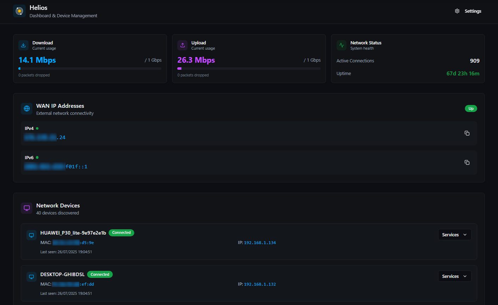

# **Helios**

<strong>A modern, self-hosted dashboard for network and server management.</strong>

## **About The Project**

Helios is a powerful, open-source application designed to give you a comprehensive overview and control over your home network and servers. Built with a high-performance Rust backend and a responsive React frontend, Helios provides real-time network status, device discovery, and a framework for managing a wide array of services.

Whether you're a homelab enthusiast, a developer, or just someone who wants more insight into their network, Helios aims to be the central hub for all your device management needs.

## **Core Features**

Helios is built around a few core concepts to provide a powerful and user-friendly experience:

* **Router API Integration:** Helios monitors your network and automatically discovers devices connected to it by communicating with your router's API. This provides a real-time list of all connected hosts, which Helios then uses as a foundation for tracking and management.
* **Manual Service Management:** As a foundational starting point, users can manually define and track any service on any device, providing an immediate way to bring services under management.
* **Agent-Based Configuration:** The primary method for managing a service is through a lightweight Helios Agent. Helios provides a secure, one-line installation script to deploy the agent on a target machine for to control the managed service.
* **On-Demand Service Discovery:** Instead of noisy, constant network chatter, Helios empowers you to initiate a network scan on a specific device right from the UI, providing a safe and controlled way to find running services.
* **Configurable Scan Depth & Asynchronous Reporting:** Choose between **Fast, Standard,** and **Deep** scan modes to balance speed and thoroughness. All scans run as background jobs, and you can opt-in for an email notification upon completion.

## **Tech Stack**

Helios is built with modern, performant technologies:

* **Backend:** [Rust](https://www.rust-lang.org/) with the [Axum](https://github.com/tokio-rs/axum) web framework and [axum-distributed-routing](https://github.com/0Killian/axum-distributed-routing) library (currently in development).
* **Frontend:** [React](https://reactjs.org/) with [Vite](https://vitejs.dev/).
* **Database:** [PostgreSQL](https://www.postgresql.org/) with [SQLx](https://github.com/launchbadge/sqlx).
* **Scanning Engine:** Leverages the power of [Nmap](https://nmap.org/) for network discovery.

## **Project Status & Roadmap**

Helios is currently under active development. You can follow our progress and see the breakdown of tasks on our [**GitHub Project Board**](https://github.com/users/0Killian/projects/3).

Our high-level roadmap is broken down into the following major milestones:

* **E1: Data Model & Manual Service Foundation (MVP)**
* **E2: Agent-Based Management**
* **E3: Core Scanning Engine**
* **E4: Advanced Scanning & Asynchronous UI**
* **E5: Notification System**

## **Getting Started**

**Note:** Installation instructions will be added here once the project reaches a more mature state.

## **Contributing**

Contributions are what make the open-source community such an amazing place to learn, inspire, and create. Any contributions you make are **greatly appreciated**.

If you have a suggestion that would make this better, please fork the repo and create a pull request. You can also simply open an issue with the tag "enhancement".

1. Fork the Project
2. Create your Feature Branch (git checkout \-b feature/AmazingFeature)
3. Commit your Changes (git commit \-m 'Add some AmazingFeature')
4. Push to the Branch (git push origin feature/AmazingFeature)
5. Open a Pull Request

## **License**

Distributed under the MIT License. See [LICENSE](LICENSE) for more information.
